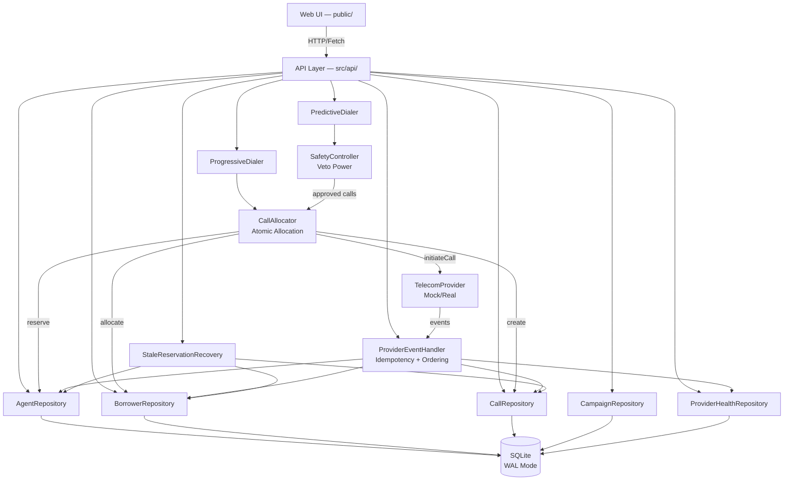

# SmartDialer

## 1. Project Overview

SmartDialer is a **predictive and progressive outbound dialing platform** designed for call-center environments — particularly debt collection, telemarketing, and customer outreach campaigns. The system solves the core problem of **agent utilization**: in a naive setup, agents spend significant time waiting for calls to connect, listening to ringing, or handling busy/no-answer lines. SmartDialer automatically paces outbound calls so that when an agent finishes one call, another connected borrower is already waiting.

### The Problem It Solves

- **Agent idle time**: Without predictive dialing, agents waste 40-60% of their time dialing and waiting for connections.
- **Overdial safety**: Predictive dialing risks abandoned calls (borrower answers but no agent is free), which is regulated by the FCC (3% max abandon rate).
- **Concurrency safety**: Multiple workers can run dialer ticks simultaneously without double-allocating agents or borrowers.
- **Provider reliability**: Telecom providers fail, timeout, and send duplicate/out-of-order events. The system handles all of these gracefully.

### Main Purpose

Provide a production-grade dialing platform that:
- Guarantees calls placed never exceed safely allocated agents
- Enforces regulatory abandon rate limits
- Recovers automatically from worker crashes and stale reservations
- Tracks provider health and degrades gracefully

### Who Can Use It

- Call center operators managing outbound campaigns
- Collection agencies dialing borrower phone numbers
- Telemarketing teams running high-volume outreach
- Developers building or studying predictive dialing systems

### Main Features

- **Two dialing modes**: Progressive (1:1, safe) and Predictive (overdial for efficiency)
- **Safety Controller**: Independent veto power over dialing decisions
- **State machines**: Explicit agent and call state machines with validated transitions
- **Optimistic locking**: All mutable entities use version-based concurrency control
- **Provider event processing**: Idempotent, ordered, and state-machine-protected
- **Stale reservation recovery**: Automatic reclamation of abandoned resources
- **Provider health tracking**: Real-time health status (HEALTHY/DEGRADED/UNHEALTHY)
- **Simulation & benchmarking**: Built-in scenarios comparing progressive vs. predictive
- **Web dashboard**: Full-featured web UI for managing all operations

---

## 2. Existing Console Application

The original application is a **console/CLI-based system** with the following workflows:

### Console Workflows

1. **Start the server**: `npm run start` or `npm run dev` — starts the Express API server on port 3000.
2. **Run simulations**: `npm run simulate` — runs all benchmark scenarios via `src/simulation/run.ts`, comparing progressive vs. predictive dialing with formatted console output.
3. **Run load tests**: `npm run loadtest` — runs load testing via `src/loadtest/run.ts`.
4. **Run tests**: `npm test`, `npm run test:unit`, `npm run test:integration`, `npm run test:concurrency` — comprehensive test suites.
5. **API interaction**: The Express server exposes REST API endpoints for all operations (campaigns, agents, borrowers, dialer, simulation, metrics).

### How Console Workflows Map to the Web UI

| Console Workflow | Web UI Equivalent |
|---|---|
| `npm run simulate` (run scenarios) | Simulation page — run scenarios with visual comparison tables |
| `POST /api/campaigns` (curl/HTTP) | Campaigns page — "New Campaign" button with form modal |
| `POST /api/campaigns/:id/tick` (curl/HTTP) | Dialer Control page — "Run Tick" form with results display |
| `POST /api/events` (webhook) | Dialer Control page — "Process Provider Event" form |
| `GET /api/campaigns/:id/metrics` | Dashboard & Campaign Detail — auto-fetched stat cards |
| `POST /api/recovery/stale` | Recovery page — "Run Recovery" form with summary |
| `GET /api/providers/health` | Provider Health page — health table with status badges |

---

## 3. New Web Application

### Why the Web UI Was Added

The original system was accessible only via HTTP API calls (curl, Postman) or CLI scripts. The web UI provides a **visual, interactive interface** that makes all functionality accessible to operators without technical knowledge.

### Main Pages

1. **Dashboard** — Overview of all campaigns, agents, borrowers, calls, and provider health with summary stat cards and recent activity tables.
2. **Campaigns** — List all campaigns with status management. Click any campaign to see its detail page with tabs for agents, borrowers, calls, and config.
3. **Campaign Detail** — Tabbed view showing agents, borrowers, calls, and configuration for a specific campaign. Includes "Run Tick" button and inline status changes.
4. **Agents** — All agents across all campaigns with state breakdown, state transition controls, and heartbeat functionality.
5. **Borrowers** — All borrowers across campaigns with status filtering, priority display, and add functionality.
6. **Calls** — All calls placed by the dialer with state breakdown and detailed information including failure reasons.
7. **Dialer Control** — Manual dialer tick triggering with mode override, plus provider event submission (webhook simulation).
8. **Simulation** — Run benchmark scenarios comparing progressive vs. predictive dialing, or run custom simulations with configurable parameters.
9. **Provider Health** — Telecom provider health metrics including success/failure counts, latency, and health status.
10. **Recovery** — Trigger stale reservation recovery to reclaim abandoned agent reservations and fail stuck calls.
11. **Settings** — System status and configuration overview.

### Sidebar Navigation

The left sidebar provides navigation to all pages with active state highlighting, a brand logo, and a system status indicator at the bottom.

### Dashboard

The dashboard fetches real data from the API:
- **Stat cards**: Total campaigns, active campaigns, total agents, total borrowers, completed calls, failed calls, provider count
- **Recent campaigns table**: Last 5 campaigns with clickable rows
- **Provider health table**: All providers with health status

### Forms

- **Create Campaign**: Modal form with name, mode (progressive/predictive), target abandonment rate, and max concurrency.
- **Add Agents**: Modal form with initial state and count (batch creation).
- **Add Borrower**: Modal form with phone number and priority.
- **Agent State Transition**: Modal showing valid target states based on the state machine.
- **Dialer Tick**: Form with campaign selector and optional mode override.
- **Provider Event**: Form for submitting webhook events (eventId, providerCallId, eventType, sequenceNumber).
- **Custom Simulation**: Full form with mode, provider type, agent/borrower/tick counts, answer rate, failure rate, and seed.
- **Recovery**: Form with optional campaign selector.

### Tables

All tables are sortable, responsive, and include:
- Status badges with color coding
- Truncated UUIDs for readability
- Formatted timestamps
- Empty states with helpful messages
- Clickable rows for navigation (campaigns)
- Inline action buttons (state transitions, heartbeats)

### Backend Integration

The web UI connects directly to the existing Express API. No new backend code was added except:
- Static file serving (`express.static`) in `app.ts`
- SPA fallback route for client-side routing

All business logic remains in the existing services, repositories, and domain models.

---

## 4. Features

### Campaign Management
- Create campaigns with progressive or predictive dialing mode
- Change campaign status (created → active → paused → completed → cancelled)
- View campaign configuration (target abandonment rate, max concurrency, etc.)
- Per-campaign metrics: agent breakdown, call counts, borrower status distribution, abandonment rate

### Agent Management
- Create agents individually or in batch (up to 100 at once)
- State machine with 7 states: OFFLINE, AVAILABLE, RESERVED, DIALING, CONNECTED, WRAP_UP, PAUSED
- Validated state transitions — only allowed transitions are offered in the UI
- Optimistic locking prevents concurrent state conflicts
- Heartbeat mechanism for agent liveness tracking
- Stale reservation detection and recovery

### Borrower Management
- Add borrowers with phone number and priority (0-10, higher = more urgent)
- Deterministic selection algorithm: highest priority → oldest last attempt → stable ID tie-breaker
- Retry with exponential backoff after call failures
- Borrower statuses: eligible, allocated, completed, exhausted, do_not_call, invalid_number
- Maximum retry attempts (default: 3) before exhaustion

### Call Lifecycle
- 9-state call state machine: QUEUED → RESERVED → INITIATED → RINGING → ANSWERED → CONNECTED → COMPLETED/FAILED/CANCELLED
- Terminal state protection — completed/failed/cancelled calls never revert
- Event ordering protection via sequence numbers
- Idempotent event processing via unique (provider, eventId) constraint
- Full audit trail with timestamps at each lifecycle stage

### Dialer Control
- **Progressive mode**: Calls = available agents - safety buffer. No overdial. Conservative.
- **Predictive mode**: Calls = available agents / predicted answer rate. Overdial capped by Safety Controller.
- Manual tick triggering via web UI
- Automatic provider event draining for mock providers

### Safety Controller
- Independent veto power over dialing decisions
- Enforces max overdial ratio (1.5x default)
- Enforces max abandon rate (3% regulatory limit)
- Blocks dialing when provider is UNHEALTHY
- Reduces calls by 50% when provider is DEGRADED
- Pure function: (system_state, proposed_calls) → approved_calls

### Provider Event Processing
- Three-layer protection: Idempotency → Event Ordering → State Machine
- Handles duplicate events (same eventId processed twice)
- Handles out-of-order events (sequence number comparison)
- Handles backward transitions (state machine rejects)
- Side effects: agent state transitions, borrower completion/release, provider health recording

### Stale Reservation Recovery
- Detects agents stuck in RESERVED state beyond lease timeout (60s default)
- Reclaims agents back to AVAILABLE
- Fails associated calls with "stale_reservation_timeout"
- Releases or exhausts associated borrowers
- Uses optimistic locking to prevent race conditions

### Provider Health Tracking
- Tracks total/successful/failed/timed-out calls per provider
- Calculates health status: HEALTHY → DEGRADED (3+ consecutive failures) → UNHEALTHY (10+ consecutive failures)
- Records last failure and success timestamps
- Used by Safety Controller for dialing decisions

### Simulation & Benchmarking
- 4 predefined benchmark scenarios:
  - **Scenario A**: Low answer rate (20%) — tests predictive pacing keeping agents busy
  - **Scenario B**: Medium answer rate (50%) — typical production environment
  - **Scenario C**: High answer rate (70%) — safety stress test for overdial clamping
  - **Scenario D**: Unreliable provider — network stress with timeouts, dropped calls, out-of-order events
- Custom simulation with configurable parameters
- Side-by-side comparison of progressive vs. predictive results
- Invariant verification: no double reservation, all calls terminal, no orphaned agents
- Tick-by-tick metrics breakdown

---

## 5. Technology Stack

| Technology | Usage |
|---|---|
| **TypeScript** | Primary language for all backend code |
| **Node.js** | Runtime (uses built-in `node:sqlite` module) |
| **Express** | Web framework / API server |
| **SQLite** | Database (via `node:sqlite`, WAL mode, zero external DB dependencies) |
| **UUID** | ID generation (`uuid` v10) |
| **Vitest** | Test framework |
| **TSX** | TypeScript execution for development |
| **HTML/CSS/JavaScript** | Frontend (vanilla, no framework — single-page application) |
| **Inter Font** | Web font (Google Fonts) |

---

## 6. Project Structure

```
SmartDailer/
├── src/
│   ├── allocation/
│   │   └── CallAllocator.ts          # Atomic agent+borrower+call allocation
│   ├── api/                          # Express API routers (controllers)
│   │   ├── agents.ts                 # Agent CRUD + state transitions
│   │   ├── borrowers.ts             # Borrower CRUD + batch creation
│   │   ├── campaigns.ts             # Campaign CRUD + status management
│   │   ├── dialer.ts                 # Dialer tick + event processing
│   │   ├── metrics.ts               # Campaign metrics + provider health + recovery
│   │   └── simulation.ts            # Scenario running + custom simulation
│   ├── common/
│   │   └── logger.ts                 # Structured logging
│   ├── config.ts                     # Centralized configuration (env vars + defaults)
│   ├── domain/                       # Domain models + repositories
│   │   ├── agent/
│   │   │   ├── AgentRepository.ts    # Agent DB operations + optimistic locking
│   │   │   └── AgentState.ts         # Agent model + state machine
│   │   ├── borrower/
│   │   │   ├── Borrower.ts           # Borrower model + statuses
│   │   │   └── BorrowerRepository.ts # Borrower DB ops + deterministic selection
│   │   ├── call/
│   │   │   ├── CallRepository.ts     # Call DB ops + state transitions
│   │   │   └── CallState.ts          # Call model + state machine
│   │   ├── campaign/
│   │   │   ├── Campaign.ts           # Campaign model + config
│   │   │   └── CampaignRepository.ts # Campaign DB operations
│   │   └── provider/
│   │       ├── ProviderHealth.ts     # Provider health model
│   │       └── ProviderHealthRepository.ts # Provider health DB ops
│   ├── events/
│   │   └── ProviderEventHandler.ts   # 3-layer event processing pipeline
│   ├── infrastructure/
│   │   ├── database.ts               # SQLite setup + transaction helper
│   │   ├── migrations.ts            # Migration runner
│   │   └── migrations/
│   │       └── 001_initial_schema.sql # Full database schema
│   ├── loadtest/
│   │   ├── LoadTest.ts               # Load testing framework
│   │   ├── run.ts                    # Load test entry point
│   │   └── runLoadTest.ts           # Load test runner
│   ├── pacing/
│   │   ├── PredictiveDialer.ts       # Predictive pacing algorithm
│   │   └── ProgressiveDialer.ts       # Progressive pacing algorithm
│   ├── provider/
│   │   ├── ReliableMockProvider.ts   # Mock provider (reliable)
│   │   ├── TelecomProvider.ts        # Provider interface
│   │   └── UnreliableMockProvider.ts # Mock provider (unreliable)
│   ├── recovery/
│   │   └── StaleReservationRecovery.ts # Stale reservation reclamation
│   ├── safety/
│   │   └── SafetyController.ts       # Independent safety gate with veto power
│   ├── simulation/
│   │   ├── SimulationRunner.ts       # Multi-tick simulation engine
│   │   ├── run.ts                    # Simulation entry point
│   │   ├── runScenarios.ts          # Scenario runner
│   │   └── scenarios.ts             # Benchmark scenario definitions
│   ├── app.ts                        # Express app setup + static file serving
│   └── server.ts                     # Server entry point
├── public/                           # Frontend web UI
│   ├── app.js                        # SPA application logic
│   ├── index.html                    # HTML shell
│   └── styles.css                    # Stylesheet
├── tests/                            # Test suites
│   ├── concurrency/                  # Concurrency safety tests
│   ├── helpers/
│   │   └── testDb.ts                 # Test database helper
│   ├── integration/                  # Integration tests
│   ├── simulation/                   # Simulation tests
│   └── unit/                         # Unit tests (state machines)
├── docs/                             # Documentation
├── package.json
├── tsconfig.json
├── vitest.config.ts
└── README.md
```

### Key Directory Responsibilities

- **`src/api/`** — Express routers that handle HTTP requests and responses. These are the controllers.
- **`src/domain/`** — Business logic: models, state machines, and repositories (data access layer).
- **`src/pacing/`** — Dialing algorithms (progressive and predictive).
- **`src/safety/`** — Safety Controller with veto power over dialing decisions.
- **`src/allocation/`** — Atomic allocation of agents, borrowers, and calls.
- **`src/events/`** — Provider event processing pipeline with idempotency and ordering.
- **`src/recovery/`** — Stale reservation recovery.
- **`src/infrastructure/`** — Database setup, migrations, and schema.
- **`src/simulation/`** — Simulation engine and benchmark scenarios.
- **`public/`** — Frontend web UI (vanilla HTML/CSS/JS SPA).
- **`tests/`** — Unit, integration, concurrency, and simulation tests.

---

## 7. Architecture

SmartDialer follows a **layered architecture** with clear separation of concerns:

```
Web UI (public/)
    ↓ HTTP/Fetch
Controller / API Layer (src/api/)
    ↓
Service / Domain Layer (src/pacing/, src/safety/, src/allocation/, src/events/, src/recovery/)
    ↓
Repository / Data Access Layer (src/domain/*/Repository.ts)
    ↓
Database (SQLite via node:sqlite)
```

### Layer Details

1. **Web UI** (`public/`): Vanilla JavaScript SPA that makes fetch() calls to the API. No business logic in the frontend — all validation and rules are enforced server-side.

2. **Controller / API Layer** (`src/api/`): Express routers that parse HTTP requests, call the appropriate services/repositories, and return JSON responses. Thin controllers — no business logic here.

3. **Service Layer**:
   - **ProgressiveDialer / PredictiveDialer** (`src/pacing/`): Implement the two dialing strategies. Each tick: count available agents → calculate capacity → allocate calls via CallAllocator → initiate via provider.
   - **SafetyController** (`src/safety/`): Pure function that assesses proposed calls against system state. Has veto power — can reduce or reject calls proposed by the dialer.
   - **CallAllocator** (`src/allocation/`): Atomic sequence: reserve agent → allocate borrower → create call → initiate via provider. Uses database transactions for steps 1-3, provider call happens outside the transaction.
   - **ProviderEventHandler** (`src/events/`): Three-layer event processing: idempotency check → sequence ordering → state machine validation → side effects (agent/borrower state changes, health recording).
   - **StaleReservationRecovery** (`src/recovery/`): Scans for agents stuck in RESERVED state beyond lease timeout, reclaims them, fails associated calls, releases borrowers.

4. **Repository Layer** (`src/domain/*/Repository.ts`): Direct database operations using prepared statements. All mutations use optimistic locking via version columns. No business logic — just CRUD + specialized queries.

5. **Database** (SQLite): WAL mode for concurrent readers + single writer. Foreign keys enforced. CHECK constraints on all state columns. Indexes optimized for the hot paths (agent reservation, borrower selection, active call lookup, event deduplication).

### Key Design Decisions

- **Optimistic Locking**: Every mutable entity has a `version` column. Updates use `WHERE id = ? AND version = ?` — if another worker modified the row first, the update affects 0 rows and the operation fails gracefully.
- **State Machines**: Both agents and calls have explicit state machines with validated transitions. Invalid transitions are rejected — the system never allows arbitrary state mutations.
- **Terminal State Protection**: Once a call reaches COMPLETED, FAILED, or CANCELLED, it can never transition back. This is the primary defense against out-of-order events.
- **Transaction Boundary**: Database operations (agent reservation, borrower allocation, call creation) happen inside a transaction. The external provider call happens outside — this is the fundamental distributed systems boundary.
- **Safety Controller Independence**: The Safety Controller is a pure function with veto power. It never mutates state. It reads system state and advises how many calls are safe to place.

---

## 8. Architecture Diagram



---

## 9. Getting Started

### Prerequisites

- Node.js 22+ (uses built-in `node:sqlite` module)

### Installation

```bash
npm install
```

### Running the Server

```bash
npm run dev    # Development mode with hot reload
npm run start   # Production mode
```

The server starts on `http://localhost:3000`. The web UI is available at the same address.

### Running Tests

```bash
npm test                    # All tests
npm run test:unit          # Unit tests (state machines)
npm run test:integration   # Integration tests
npm run test:concurrency   # Concurrency safety tests
```

### Running Simulations

```bash
npm run simulate   # Run all benchmark scenarios
npm run loadtest   # Run load tests
```

### Building

```bash
npm run build   # Compile TypeScript to dist/
```

---

## 10. API Reference

### Campaigns
| Method | Endpoint | Description |
|---|---|---|
| POST | `/api/campaigns` | Create a new campaign |
| GET | `/api/campaigns` | List all campaigns |
| GET | `/api/campaigns/:id` | Get campaign details |
| PATCH | `/api/campaigns/:id/status` | Update campaign status |

### Agents
| Method | Endpoint | Description |
|---|---|---|
| POST | `/api/campaigns/:campaignId/agents` | Create agent(s) |
| GET | `/api/campaigns/:campaignId/agents` | List agents for a campaign |
| GET | `/api/agents/:id` | Get agent details |
| PATCH | `/api/agents/:id/state` | Transition agent state |
| POST | `/api/agents/:id/heartbeat` | Record agent heartbeat |

### Borrowers
| Method | Endpoint | Description |
|---|---|---|
| POST | `/api/campaigns/:campaignId/borrowers` | Add borrower(s) |
| GET | `/api/campaigns/:campaignId/borrowers` | List borrowers (filter by status) |
| GET | `/api/borrowers/:id` | Get borrower details |

### Dialer
| Method | Endpoint | Description |
|---|---|---|
| POST | `/api/campaigns/:campaignId/tick` | Run a dialer tick |
| POST | `/api/events` | Process a provider event |
| GET | `/api/campaigns/:campaignId/calls` | List calls for a campaign |

### Metrics
| Method | Endpoint | Description |
|---|---|---|
| GET | `/api/campaigns/:campaignId/metrics` | Get campaign metrics |
| GET | `/api/providers/health` | Get provider health |
| POST | `/api/recovery/stale` | Run stale reservation recovery |

### Simulation
| Method | Endpoint | Description |
|---|---|---|
| GET | `/api/simulation/scenarios` | List benchmark scenarios |
| POST | `/api/simulation/scenarios/:id/run` | Run a specific scenario |
| POST | `/api/simulation/run` | Run custom simulation |

### Health
| Method | Endpoint | Description |
|---|---|---|
| GET | `/health` | System health check |
