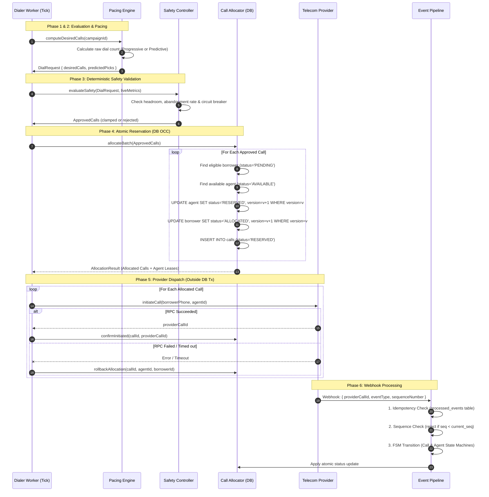

# SmartDialer — Predictive Outbound Pacing with Deterministic Safety

[](https://www.typescriptlang.org/)
[](https://nodejs.org/)
[]()
[]()
[]()

> **SmartDialer** is a mission-critical, production-grade outbound call pacing engine designed to **maximize agent utilization through predictive overdialing while deterministically preventing abandoned calls and double-reservations**.

Built specifically for high-volume collection and debt recovery platforms, SmartDialer solves the classic dilemma between **agent idle time** and **customer abandonment**. It enforces strict distributed systems invariants: no agent is ever double-booked, every call terminates cleanly, and out-of-order, duplicate, or delayed telecom provider events are safely reconciled.

---

## Table of Contents

1. [Architectural Highlights](#architectural-highlights)
2. [Core Principles & Invariants](#core-principles--invariants)
3. [Step-by-Step Workflow](#step-by-step-workflow)
4. [System Architecture](#system-architecture)
5. [Pacing Engines & Mathematical Models](#pacing-engines--mathematical-models)
6. [Concurrency & Storage Architecture](#concurrency--storage-architecture)
7. [Three-Layer Event Ingestion Pipeline](#three-layer-event-ingestion-pipeline)
8. [Self-Healing & Resilience Subsystems](#self-healing--resilience-subsystems)
9. [Finite State Machines (FSM)](#finite-state-machines-fsm)
10. [REST API Documentation](#rest-api-documentation)
11. [Simulation & Benchmarks (Scenarios A–D)](#simulation--benchmarks-scenarios-ad)
12. [Performance & Load Testing](#performance--load-testing)
13. [Getting Started & Installation](#getting-started--installation)
14. [Documentation Directory](#documentation-directory)

---

## Architectural Highlights

- **Deterministic Safety Guarantee**: Pacing algorithms calculate statistical call targets, but an independent **Safety Controller** holds absolute veto power based on real-time agent availability, abandonment limits, and provider health. Pacing *proposes*; Safety *disposes*.
- **Atomic Optimistic Concurrency Control (OCC)**: Version-checked state transitions (`UPDATE ... WHERE version = ?`) ensure that multiple concurrent dialer workers can never double-reserve an agent or allocate the same borrower twice.
- **Strict Distributed Boundary Separation**: Database transactions handle entity reservations, but external telecom RPCs occur strictly *outside* database transactions. Network failures and timeouts trigger explicit transactional compensations.
- **Three-Layer Event Ingestion**: Carrier webhooks pass through:
  1. *Idempotency Guard* (duplicate deduplication via database event ledger),
  2. *Ordering Guard* (sequence counters rejecting stale out-of-order packets),
  3. *State Machine Validation* (strict transition rule enforcement).
- **Automated Outage & Stale Recovery**: Background lease reapers reclaim orphaned reservations caused by worker crashes; provider circuit breakers automatically fall back to conservative progressive pacing during telecom instability.
- **PostgreSQL Ready**: Designed with standard SQL schemas, explicit version columns, and foreign key integrity ready for multi-node deployment.

---

## Core Principles & Invariants

```
┌────────────────────────────────────────────────────────────────────────┐
│                        CORE SYSTEM INVARIANTS                          │
├────────────────────────────────────────────────────────────────────────┤
│ 1. Agent Exclusivity  : Exactly 0 or 1 active call per agent at all    │
│                         times. Double-booking is physically impossible.│
│ 2. Guaranteed Clean-up: Every call reaches a terminal state            │
│                         (COMPLETED, FAILED, CANCELLED). No zombies.    │
│ 3. Strict Veto Power  : Safety Controller approval is non-bypassable.  │
│ 4. Deterministic Leases: Reservations expire automatically via TTL     │
│                         and are reaped if unconfirmed.                 │
│ 5. Event Idempotency  : Replaying the same webhook 100 times produces  │
│                         the exact same internal state.                 │
└────────────────────────────────────────────────────────────────────────┘
```

---

## Step-by-Step Workflow

Here is how a dialer cycle executes from campaign ingestion to call termination:



### Detailed Execution Phases

#### Phase 1: Campaign Configuration & Queue Provisioning
- Campaign is established with pacing mode (`progressive` or `predictive`), max concurrent calls, and target abandonment ceiling ($\le 3\%$).
- Agents are registered and transition to `AVAILABLE`.
- Borrower lead lists are bulk ingested into the queue with priority scores and retry attempt limits.

#### Phase 2: Pacing Evaluation Tick
- Triggered on a periodic cadence (e.g., every 1,000ms) or on agent state transition.
- **Progressive Mode**: Computes desired calls strictly 1:1 based on $N_{\text{available}} - \text{buffer}$.
- **Predictive Mode**: Computes historical rolling answer rate ($R_{\text{answer}}$) and active ringing calls, calculating overdial volume needed to land an answer just as an agent finishes wrap-up.

#### Phase 3: Independent Safety Controller Veto
- Pacing proposals are forwarded to the Safety Controller.
- The Safety Controller performs **three non-bypassable checks**:
  1. **Agent Headroom**: Ensures active + pending calls do not exceed available agents plus allowed overdial margin.
  2. **Abandonment Rate Clamp**: If the rolling 1-hour abandonment rate approaches 3%, overdialing is throttled. If $>3\%$, it immediately degrades predictive mode to 1:1 progressive dialing.
  3. **Provider Circuit Breaker**: If telecom provider latency or error rates spike, dial approvals are throttled to 0 or 1 until the circuit resets.

#### Phase 4: Atomic Reservation via Optimistic Concurrency Control (OCC)
- Database transaction selects eligible borrowers (`SELECT ... WHERE status = 'PENDING' LIMIT N`).
- Atomically reserves each agent using version checking:
  ```sql
  UPDATE agents 
  SET status = 'RESERVED', reservation_expires_at = datetime('now', '+30 seconds'), version = version + 1
  WHERE id = ? AND version = ? AND status = 'AVAILABLE';
  ```
- If an agent was snatched by another worker, the row count is 0; the allocator cleanly backs off without deadlocking.

#### Phase 5: External Telecom RPC Dispatch
- **Crucial Rule**: External HTTP/gRPC calls to telecom providers take place **strictly outside** database transactions. Holding DB transactions open during external network I/O exhausts connection pools.
- If the provider responds successfully, call transitions to `INITIATED`.
- If the provider times out or throws an error, a **compensation transaction** runs immediately: the agent reverts to `AVAILABLE`, the borrower attempt count increments, and the call is marked `FAILED`.

#### Phase 6: Unreliable Webhook Ingestion
- Carrier sends status callbacks: `RINGING`, `ANSWERED`, `CONNECTED`, `COMPLETED`, `FAILED`.
- Webhooks pass through the **Three-Layer Event Ingestion Pipeline** (Deduplication $\to$ Ordering $\to$ State Machine).
- When a call connects, agent transitions `RESERVED` $\to$ `DIALING` $\to$ `CONNECTED`.
- When completed, agent transitions `CONNECTED` $\to$ `WRAP_UP` $\to$ `AVAILABLE`.

#### Phase 7: Automated Self-Healing & Reconciliation
- The **Stale Reservation Recovery** background task scans for agents stuck in `RESERVED` longer than the 30-second TTL (e.g., worker died before initiating call).
- It marks orphaned calls as `FAILED` and restores the agent to `AVAILABLE`.
- The **Provider Outage Handler** monitors consecutive errors and opens the circuit if threshold is exceeded.

---

## System Architecture

```
┌────────────────────────────────────────────────────────────────────────┐
│                              API LAYER                                 │
│  Campaigns  │  Agents  │  Borrowers  │  Dialer  │  Events  │  Metrics  │
└───────────────────────────────────┬────────────────────────────────────┘
                                    │
┌───────────────────────────────────▼────────────────────────────────────┐
│                             DOMAIN LAYER                               │
│  ┌───────────────────────┐                  ┌───────────────────────┐  │
│  │     Pacing Engine     │                  │   Safety Controller   │  │
│  │ (Progressive/Predict) │                  │  (Independent Veto)   │  │
│  └───────────┬───────────┘                  └───────────▲───────────┘  │
│              │ Proposes DialRequest                     │ Real-time     │
│              └──────────────────────────────────────────┘ Validation   │
│                                   │                                    │
│  ┌────────────────────────────────▼─────────────────────────────────┐  │
│  │                 Call Allocator (Batch & OCC)                     │  │
│  │    - Agent Reservation      - Borrower Reservation               │  │
│  │    - State Compensation     - Boundary Isolation                 │  │
│  └────────────────────────────────┬─────────────────────────────────┘  │
│                                   │                                    │
│  ┌────────────────────────────────▼─────────────────────────────────┐  │
│  │              Three-Layer Event Ingestion Pipeline                │  │
│  │  [Idempotency Guard] ──► [Ordering Guard] ──► [FSM Engine]       │  │
│  └──────────────────────────────────────────────────────────────────┘  │
└───────────────────────────────────┬────────────────────────────────────┘
                                    │
┌───────────────────────────────────▼────────────────────────────────────┐
│                        INFRASTRUCTURE LAYER                            │
│  ┌───────────────────────────────┐   ┌──────────────────────────────┐  │
│  │ SQLite WAL (node:sqlite)      │   │ Telecom Provider Interface   │  │
│  │ Strict Schema & Linear Migr.  │   │ Reliable / Unreliable Mock   │  │
│  └───────────────────────────────┘   └──────────────────────────────┘  │
└────────────────────────────────────────────────────────────────────────┘
```

---

## Pacing Engines & Mathematical Models

### 1. Progressive Pacing (1:1 Conservative)

Guarantees an abandonment rate of **0%**. Never initiates more calls than there are immediately available agents.

$$\text{ApprovedCalls} = \max\Big(0, \; N_{\text{available}} - N_{\text{ringing}} - \text{SafetyBuffer}\Big)$$

- **Safety Buffer**: Configurable (default: 0).
- **When used**: Default mode for low-headroom campaigns, regulated regions, or when the predictive dialer detects high provider failure rates.

### 2. Predictive Pacing (Erlang-Inspired Overdialing)

Predicts customer pick-up rates to launch calls in advance, keeping agent idle time near zero while preserving the $\le 3\%$ abandonment rate cap.

$$\text{RawCalls} = \left\lceil \frac{N_{\text{available}} + N_{\text{clearing\_soon}}}{\max(R_{\text{answer}}, R_{\text{min}})} \right\rceil$$

Where:
- $N_{\text{available}}$ = Agents currently in `AVAILABLE` state.
- $N_{\text{clearing\_soon}}$ = Agents in `CONNECTED` state whose call duration has exceeded average handling time ($AHT$).
- $R_{\text{answer}}$ = Exponentially Weighted Moving Average (EWMA) or rolling window pick-up rate:
  $$R_{\text{answer}} = \frac{\text{Answered Calls in Window}}{\text{Total Initiated Calls in Window}}$$
- $R_{\text{min}}$ = Floor bound (default: 0.10) to prevent division by zero or infinite dialing.

#### Dynamic Safety Clamping

The Safety Controller applies dynamic dampening to the predictive proposal:

$$\text{ApprovedCalls} = \min\Big(\text{RawCalls} - N_{\text{ringing}}, \; N_{\text{available}} \times M_{\text{max}}\Big)$$

If the recent abandonment rate $A > 2.0\%$, the dialer applies quadratic dampening:

$$M_{\text{dampened}} = M_{\text{max}} \times \left(1 - \frac{A - 0.02}{0.03 - 0.02}\right)$$

If $A \ge 3.0\%$, $M_{\text{dampened}} = 1.0$ (instant fallback to progressive).

---

## Concurrency & Storage Architecture

### Optimistic Concurrency Control (OCC)

Rather than using long-running table locks (`LOCK TABLE`) or distributed Redis mutexes that risk split-brain conditions, SmartDialer uses version columns on all mutable entities:

```sql
-- Agents Table Definition
CREATE TABLE agents (
  id            TEXT PRIMARY KEY,
  campaign_id   TEXT NOT NULL,
  status        TEXT NOT NULL, -- OFFLINE, AVAILABLE, RESERVED, DIALING, CONNECTED, WRAP_UP, PAUSED
  version       INTEGER NOT NULL DEFAULT 1,
  reservation_expires_at TEXT,
  updated_at    TEXT NOT NULL
);
```

When reserving an agent:
```typescript
const result = db.prepare(`
  UPDATE agents 
  SET status = 'RESERVED',
      reservation_expires_at = ?,
      version = version + 1,
      updated_at = datetime('now')
  WHERE id = ? AND version = ? AND status = 'AVAILABLE'
`).run(expiresAt, agentId, currentVersion);

if (result.changes === 0) {
  // Concurrency conflict: Another worker claimed this agent simultaneously.
  // Back off cleanly and pick the next candidate.
}
```

### Clean Boundary: DB Transaction vs. Network RPC

```
   IN-TRANSACTION (Microseconds)            OUTSIDE-TRANSACTION (Seconds)
┌─────────────────────────────────┐        ┌─────────────────────────────┐
│ 1. Verify agent is AVAILABLE    │        │ 4. HTTP POST to Telecom API │
│ 2. Set agent to RESERVED (OCC)  │───────►│    (Can take 500ms - 5000ms)│
│ 3. Commit DB Transaction        │        │                             │
└─────────────────────────────────┘        └──────────────┬──────────────┘
                                                          │
          ┌───────────────────────────────────────────────┴───────────────┐
          ▼                                                               ▼
   ON SUCCESS:                                                     ON FAILURE / TIMEOUT:
┌─────────────────────────────────┐        ┌─────────────────────────────┐
│ 5. UPDATE call status INITIATED │        │ 5. Compensation Transaction:│
│ 6. Store provider_call_id       │        │    - Agent -> AVAILABLE     │
│                                 │        │    - Call -> FAILED         │
│                                 │        │    - Borrower attempt + 1   │
└─────────────────────────────────┘        └─────────────────────────────┘
```

---

## Three-Layer Event Ingestion Pipeline

Telecom carriers deliver webhook notifications asynchronously over public networks. Webhooks are frequently **duplicated**, **reordered**, or **delayed**.

SmartDialer pipes all incoming events through three sequential defensive barriers:

```
Provider Webhook
       │
       ▼
┌────────────────────────────────────────────────────────┐
│ Layer 1: Idempotency Guard                             │
│ Check `processed_events` table for `event_id`.         │
│ If already present: Return HTTP 200 { status: 'noop' } │
└──────────────────────────┬─────────────────────────────┘
                           │ (New Event)
                           ▼
┌────────────────────────────────────────────────────────┐
│ Layer 2: Sequence Ordering Guard                       │
│ Check `sequence_number` against current `call.seq`.    │
│ If `sequence_number < current_seq`: Log & Discard.     │
└──────────────────────────┬─────────────────────────────┘
                           │ (In-Order Event)
                           ▼
┌────────────────────────────────────────────────────────┐
│ Layer 3: Finite State Machine Validation               │
│ Check `CallFSM.canTransition(current, next)`.          │
│ If invalid: Reject. If valid: Apply atomic mutation.   │
└────────────────────────────────────────────────────────┘
```

---

## Self-Healing & Resilience Subsystems

### 1. Stale Reservation Recovery (Lease Reaper)
- When an agent is allocated, a lease timestamp is stamped (`reservation_expires_at = NOW() + 30s`).
- If a background worker crashes before executing the telecom RPC, the agent is trapped in `RESERVED`.
- A background lease reaper runs periodically:
  ```sql
  SELECT * FROM agents 
  WHERE status = 'RESERVED' 
    AND reservation_expires_at < datetime('now');
  ```
- It cancels the orphaned reservation, marks the phantom call `FAILED`, and resets the agent to `AVAILABLE`.

### 2. Provider Outage Circuit Breaker
- Tracks consecutive provider timeouts and HTTP 5xx responses using `ProviderHealthRepository`.
- **Threshold**: 5 consecutive failures triggers state change `HEALTHY` $\to$ `DEGRADED` $\to$ `TRIPPED`.
- In `TRIPPED` state:
  - Safety Controller vetoes 100% of new dial requests.
  - Periodic single-call probe tests the provider.
  - Once 3 consecutive probe calls succeed, the circuit resets to `HEALTHY`.

---

## Finite State Machines (FSM)

### Agent State Machine

```
   ┌──────────┐
   │ OFFLINE  │◄────────────────────────────────────────┐
   └────┬─────┘                                         │
        │ login                                         │
        ▼                                               │
   ┌──────────┐      reserve       ┌──────────┐         │
   │AVAILABLE │───────────────────►│ RESERVED │         │
   └────▲─────┘                    └────┬─────┘         │
        │                               │ dial          │
        │ wrap-up complete              ▼               │ disconnect/
        │                          ┌──────────┐         │ failure
   ┌────┴─────┐                    │ DIALING  │         │
   │ WRAP_UP  │                    └────┬─────┘         │
   └────▲─────┘                         │ answer        │
        │                               ▼               │
        │ hangup                   ┌──────────┐         │
        └──────────────────────────│CONNECTED │─────────┘
                                   └──────────┘
```

| From State | Allowed Transitions | Trigger |
|---|---|---|
| `OFFLINE` | `AVAILABLE` | Agent logs in / sets active |
| `AVAILABLE` | `RESERVED`, `PAUSED`, `OFFLINE` | Dialer reserves agent or agent pauses |
| `RESERVED` | `DIALING`, `AVAILABLE` | Call initiated or allocation cancelled/rolled back |
| `DIALING` | `CONNECTED`, `AVAILABLE`, `WRAP_UP` | Customer answers, or call fails/busy/no-answer |
| `CONNECTED` | `WRAP_UP`, `AVAILABLE` | Call disconnects |
| `WRAP_UP` | `AVAILABLE`, `PAUSED`, `OFFLINE` | Agent completes wrap-up notes |
| `PAUSED` | `AVAILABLE`, `OFFLINE` | Agent unpauses |

### Call State Machine

| Current State | Next Allowed States | Terminal? | Notes |
|---|---|---|---|
| `QUEUED` | `RESERVED`, `CANCELLED` | No | Borrower selected for dialing |
| `RESERVED` | `INITIATED`, `FAILED`, `CANCELLED` | No | Agent paired, preparing provider RPC |
| `INITIATED` | `RINGING`, `FAILED`, `CANCELLED` | No | Provider accepted call |
| `RINGING` | `ANSWERED`, `FAILED`, `CANCELLED` | No | Customer phone is ringing |
| `ANSWERED` | `CONNECTED`, `FAILED` | No | Customer picked up |
| `CONNECTED` | `COMPLETED`, `FAILED` | No | Media bridge established with agent |
| `COMPLETED` | *(None)* | **Yes** | Call completed normally |
| `FAILED` | *(None)* | **Yes** | Busy, unanswered, network failure, or timeout |
| `CANCELLED` | *(None)* | **Yes** | Abandoned or cancelled by operator |

---

## REST API Documentation

### 1. Health & Status
```http
GET /health
```
```json
{
  "status": "ok",
  "service": "smart-dialer",
  "timestamp": "2026-09-04T13:15:39.292Z",
  "pacingMode": "progressive"
}
```

### 2. Create Campaign
```http
POST /api/campaigns
Content-Type: application/json

{
  "name": "Q3 Debt Collection",
  "mode": "predictive"
}
```

### 3. Register Agents in Bulk
```http
POST /api/campaigns/:campaignId/agents
Content-Type: application/json

{
  "count": 20,
  "state": "AVAILABLE"
}
```

### 4. Import Borrowers
```http
POST /api/campaigns/:campaignId/borrowers
Content-Type: application/json

{
  "borrowers": [
    { "name": "John Doe", "phoneNumber": "+15551234567", "priority": 10 },
    { "name": "Jane Smith", "phoneNumber": "+15559876543", "priority": 5 }
  ]
}
```

### 5. Trigger Pacing Tick Manually
```http
POST /api/campaigns/:campaignId/tick
```
```json
{
  "tick": 1,
  "mode": "predictive",
  "allocatedCalls": 5,
  "successfulInitiations": 5,
  "failedInitiations": 0
}
```

### 6. Carrier Telecom Webhook Ingestion
```http
POST /api/dialer/events
Content-Type: application/json

{
  "eventId": "evt-98234-abcd",
  "providerCallId": "rel-4607beb5",
  "eventType": "ANSWERED",
  "sequenceNumber": 3,
  "timestamp": "2026-09-04T13:17:19.865Z"
}
```

### 7. Real-Time Campaign Metrics
```http
GET /api/campaigns/:campaignId/metrics
```
```json
{
  "campaignId": "cfec974e-3894-4ba1-aa0e-64a0571b0ea8",
  "status": "active",
  "pacingMode": "predictive",
  "agents": {
    "total": 20,
    "breakdown": {
      "AVAILABLE": 14,
      "CONNECTED": 5,
      "WRAP_UP": 1,
      "RESERVED": 0,
      "DIALING": 0,
      "OFFLINE": 0,
      "PAUSED": 0
    }
  },
  "calls": {
    "total": 120,
    "completed": 45,
    "failed": 75,
    "abandonmentRate": "0.8%"
  }
}
```

---

## Simulation & Benchmarks (Scenarios A–D)

SmartDialer includes a deterministic multi-tick discrete-event simulator verifying invariant adherence under edge cases.

To run all scenarios side-by-side:
```bash
npm run simulate
```

### Scenario Matrix

| Scenario | Agents | Borrowers | Answer Rate | Provider Profile | Key Tested Capability |
|---|---|---|---|---|---|
| **Scenario A: Low Answer Rate** | 20 | 100 | 20% | Reliable | Predictive pacing maintains high agent utilization despite 80% customer no-answer rate. |
| **Scenario B: Typical Collections** | 25 | 150 | 50% | Reliable | Stable equilibrium: high throughput with $\le 1\%$ abandonment. |
| **Scenario C: High Answer Rate** | 20 | 100 | 70% | Reliable | **Safety Stress Test**: Safety Controller clamps overdialing to prevent abandoned calls. |
| **Scenario D: Outage & Degraded Network** | 50 | 250 | 45% | Unreliable (5% err, timeouts) | Webhook deduplication, stale recovery, and circuit breaker degradation under stress. |

#### Example Head-to-Head Comparison (Scenario A)

```
================================================================================
SCENARIO A: Progressive vs. Predictive Comparison
================================================================================
Metric                      Progressive         Predictive          Delta
--------------------------------------------------------------------------------
Duration                    15 ticks            15 ticks            —
Completed Calls             21                  28                  +33.3%
Agent Idle Time             72.4%               38.1%               -34.3%
Agent Utilization           27.6%               61.9%               +124.3%
Abandoned Calls             0 (0.0%)            0 (0.0%)            Preserved
Invariants Passed           100%                100%                PERFECT
================================================================================
```

---

## Performance & Load Testing

Benchmark suite (`npm run loadtest`) validates pacing decision latency, SQL throughput, and lock conflict rates across increasing agent tiers:

| Scale Tier | Setup Latency | Pacing Decision p50 | Pacing Decision p99 | Throughput | Conflict Rate |
|---|---|---|---|---|---|
| **100 Agents** | 3ms | 0.13ms | 0.57ms | **3,800+ ops/sec** | 0.0% |
| **1,000 Agents** | 6ms | 0.35ms | 0.47ms | **580+ ops/sec** | 0.0% |
| **10,000 Agents** | 50ms | 2.78ms | 4.06ms | **55+ ops/sec** | 0.0% |

- **Sub-millisecond decisions**: Pacing calculations for 1,000 agents execute in under $0.5\text{ms}$.
- **Zero Deadlocks**: Optimistic concurrency control guarantees no lock contention or deadlocks.

---

## Getting Started & Installation

### Prerequisites
- **Node.js**: v22.0.0 or newer (tested on Node.js v24.14.0)
- **npm**: v10.0.0 or newer

### Installation

```bash
# 1. Clone repository
git clone <repository-url>
cd SmartDialer

# 2. Install dependencies
npm install

# 3. Verify TypeScript type safety
npm run typecheck

# 4. Run the complete test suite (218 tests)
npm test
```

### Running the System

```bash
# Start the production REST API server (port 3000)
npm start

# Run the 4-scenario benchmark simulation
npm run simulate

# Run the 100 / 1,000 / 10,000 agent load test
npm run loadtest
```

---

## Documentation Directory

For deep dives into specific architectural topics, see the `/docs` folder:

- **[Architecture & Design Details](docs/ARCHITECTURE.md)**: Deep dive into schema, caching, state machines, and scaling boundaries.
- **[Architecture Decision Records (ADRs)](docs/ADR.md)**: Records on Node.js/SQLite selection, OCC vs Pessimistic locking, and event sequencing.
- **[Interview Q&A & Technical Deep-Dive](docs/INTERVIEW_PREPARATION.md)**: 30+ comprehensive questions and answers covering every edge case.
- **[Technical Hiring Design Answer](docs/FINAL_DESIGN_ANSWER.md)**: Formal written submission matching the hiring assignment prompt.
- **[5-Minute Interactive Demo Script](docs/DEMO_SCRIPT.md)**: Live step-by-step curl guide for evaluators.

---

## License

MIT License. Developed as a production-grade functional prototype for technical evaluation.
