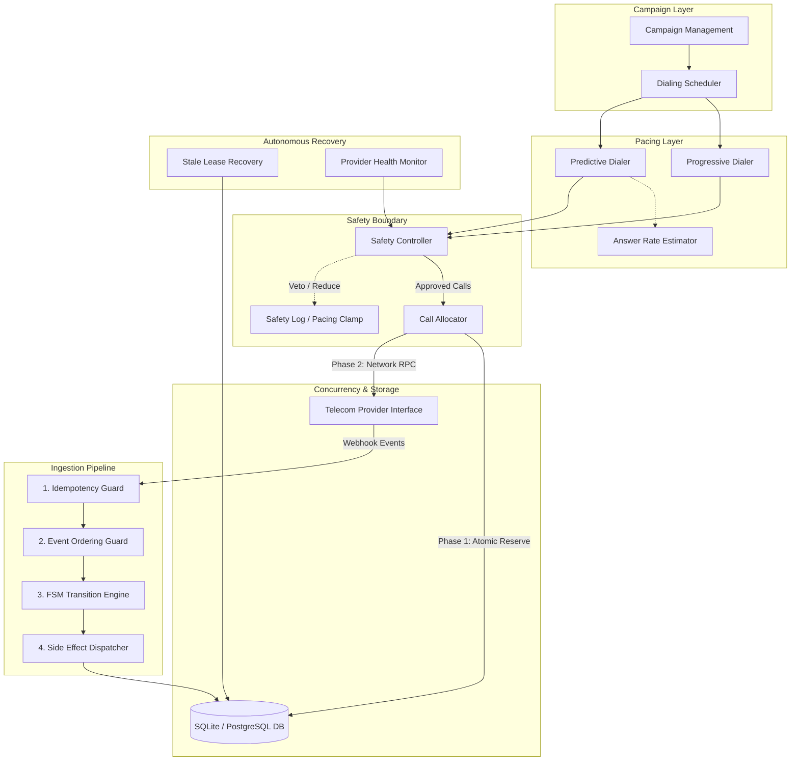
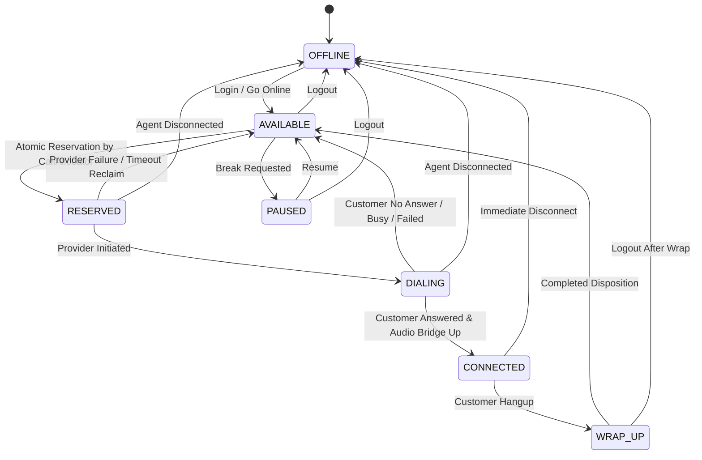
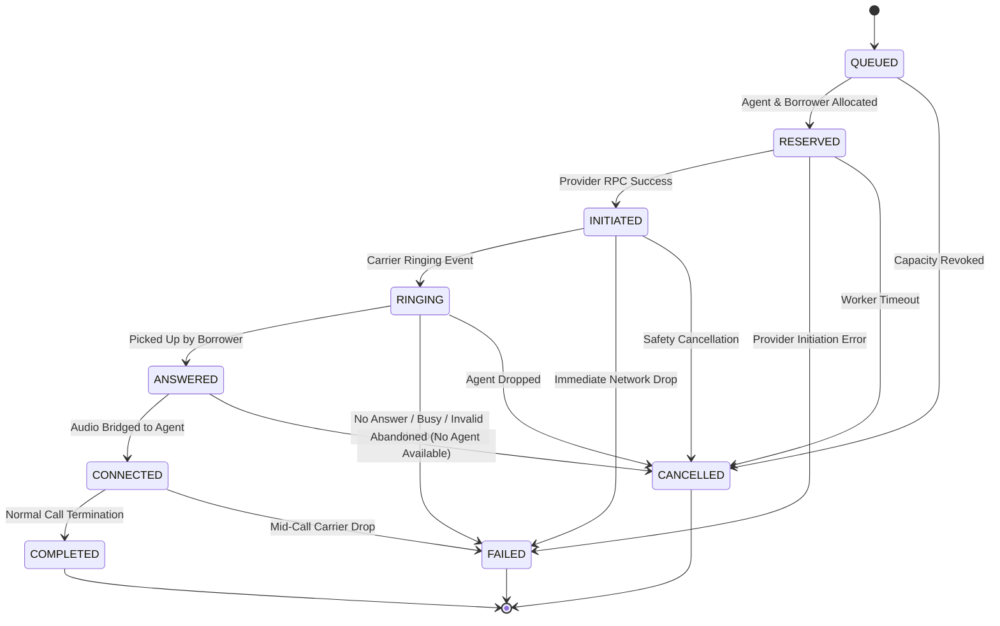
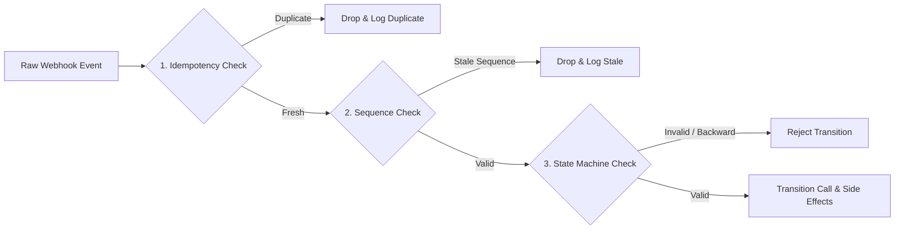

# SmartDialer System Architecture Document

## 1. Executive Summary

SmartDialer is a resilient, distributed-ready outbound dialing engine. Its core objective is to maximize contact-center agent productivity while mathematically guaranteeing compliance and eliminating silent call abandonment.

The system addresses the fundamental dilemma of outbound telephony:
* **Under-dialing** results in idle agents waiting for calls to ring.
* **Over-dialing** risks having multiple borrowers answer simultaneously when only one agent is available, causing illegal or frustrating call abandonment.

SmartDialer solves this through a **two-tier architecture**: an adaptive statistical pacing engine that predicts call answer rates, coupled to a strictly enforced, non-bypassable **Safety Controller** and atomic optimistic-locking reservation layer.

---

## 2. High-Level System Architecture



---

## 3. Finite State Machines

### 3.1 Agent Lifecycle State Machine

Agents transition through 7 explicit states. Any unpermitted transition throws an `InvalidAgentTransitionError` and is rejected by the database version check.



| State | Invariant Guarantee |
|---|---|
| `AVAILABLE` | Agent is idle and eligible for reservation. `current_call_id = NULL`. |
| `RESERVED` | Held by a specific call for at most `leaseTimeoutSec` (default 30s). Cannot be selected by any other worker. |
| `DIALING` | Outbound telecom call is in flight. |
| `CONNECTED` | Active audio path between borrower and agent. Exactly 1 live call per agent. |
| `WRAP_UP` | Call terminated, agent completing dispositions before next call. |

### 3.2 Call Lifecycle State Machine

Calls traverse 9 deterministic states with backward-transition rejection and terminal state protection.



**Terminal Protection Rule**: Once a call enters `COMPLETED`, `FAILED`, or `CANCELLED`, no subsequent provider event can alter its state. Delayed or out-of-order packets targeting terminal calls are safely acknowledged and dropped.

---

## 4. Concurrency & Distributed Boundary Design

### 4.1 The Fundamental Distributed Boundary

A database transaction cannot span an external network call. If a database lock were held while awaiting a telecom carrier RPC (50ms – 2000ms), database worker pools would rapidly exhaust, leading to system-wide lock starvation.

SmartDialer decouples this into two distinct phases:

```
[Phase 1: DB Transaction] (Takes < 1ms)
  1. Verify Agent is AVAILABLE and version = V_agent
  2. UPDATE agents SET state='RESERVED', version=V_agent+1 WHERE id=? AND version=V_agent
  3. Verify Borrower is eligible and version = V_borrower
  4. UPDATE borrowers SET status='allocated', version=V_borrower+1 WHERE id=? AND version=V_borrower
  5. INSERT INTO calls (state='RESERVED')
[COMMIT TRANSACTION]

[Phase 2: External Network Call] (Outside DB Transaction)
  Provider.initiateCall(callId, phoneNumber)
    │
    ├──► [SUCCESS: status='initiated']
    │      UPDATE calls SET state='INITIATED', provider_call_id=?
    │      UPDATE agents SET state='DIALING'
    │
    └──► [FAILURE: status='failed' OR Network Timeout]
           Compensating Transaction:
           - UPDATE calls SET state='FAILED', failure_reason=?
           - UPDATE agents SET state='AVAILABLE'
           - Release borrower with exponential backoff
```

### 4.2 Optimistic Locking Implementation

Every mutable domain table (`agents`, `borrowers`, `calls`) includes an integer `version` column.

```sql
UPDATE agents
SET state = 'RESERVED',
    current_call_id = :callId,
    reserved_at = :now,
    version = version + 1,
    updated_at = :now
WHERE id = :agentId
  AND state = 'AVAILABLE'
  AND version = :expectedVersion;
```

If 100 concurrent workers attempt to reserve the same agent:
1. SQLite/PostgreSQL evaluates the atomic `UPDATE`.
2. Exactly **1** worker updates 1 row (`changes === 1`).
3. The remaining **99** workers receive `changes === 0`.
4. Losers immediately back off and select the next available candidate without blocking or corrupting state.

---

## 5. Event Ingestion Pipeline

Telecom providers deliver webhooks asynchronously over HTTP. In unreliable networks, carriers routinely deliver duplicate events, out-of-order packets, or delayed webhooks.



1. **Layer 1: Idempotency Guard**:
   - Stores incoming `(provider_name, event_id)` with a unique database constraint.
   - If `INSERT` encounters a conflict, the event is immediately flagged as a duplicate and ignored.
2. **Layer 2: Event Ordering Guard**:
   - Each call tracks `last_provider_sequence`.
   - If an event arrives with sequence number $\le$ `last_provider_sequence`, or if the call has already entered a terminal state, the event is identified as stale and discarded.
3. **Layer 3: Finite State Machine Guard**:
   - Verifies whether `CallStateMachine.canTransition(current, target)` is valid.
   - Prevents impossible regressions (e.g. `COMPLETED` $\to$ `RINGING`).

---

## 6. Mathematical Pacing & Safety Controller

### 6.1 Pacing Formula

Given:
* $N_{avail}$: Current available agents
* $S$: Configured safety buffer (e.g. 2 agents)
* $R_{answer}$: Rolling average customer answer rate over the last $W$ calls
* $C_{pending}$: Currently ringing/initiated calls

$$\text{SafeCapacity} = \max(0, N_{avail} - S)$$

$$\text{RawCalls} = \left\lceil \frac{N_{avail}}{\max(R_{answer}, R_{min})} \right\rceil$$

$$\text{NetCallsNeeded} = \max(0, \text{RawCalls} - C_{pending})$$

### 6.2 Safety Controller Invariants

The Safety Controller cannot be bypassed by any pacing engine. It independently evaluates the following invariant checks before approving any dial:

1. **Agent Headroom Invariant**:
   $$\text{ApprovedCalls} \le \text{SafeCapacity} \times \text{MaxOverdialRatio}$$
2. **Abandonment Cap**: If measured abandonment rate over recent calls exceeds 3% ($0.03$), pacing is automatically clamped to Progressive (1:1).
3. **Provider Health Threshold**: If carrier failure rate exceeds 20% or circuit breaker trips to `UNHEALTHY`, pacing is suspended.

---

## 7. PostgreSQL Migration Blueprint

While SmartDialer utilizes synchronous SQLite (`better-sqlite3` / `node:sqlite`) with WAL mode for local zero-dependency verification, every SQL statement and design pattern was engineered for production PostgreSQL.

### Schema Equivalencies

| Feature | SQLite Implementation | PostgreSQL Production Mapping |
|---|---|---|
| Concurrency Model | `UPDATE ... WHERE version = ?` | `UPDATE ... WHERE version = ?` OR `SELECT ... FOR UPDATE SKIP LOCKED` |
| Queue Dequeue | `ORDER BY priority DESC LIMIT 1` | `SELECT id FROM borrowers WHERE status='eligible' ORDER BY priority DESC LIMIT 1 FOR UPDATE SKIP LOCKED` |
| UUIDs | Text (UUIDv4) | `UUID` native type |
| Timestamps | ISO-8601 strings in UTC | `TIMESTAMPTZ` |
| JSON Storage | `TEXT` with `JSON.parse` | `JSONB` with GIN indexing |

### Horizontal Scalability with `SKIP LOCKED`

In a multi-node deployment with dozens of distributed dialer worker pods, contention on the borrower table is eliminated using PostgreSQL's row-level queueing primitive:

```sql
SELECT id FROM borrowers
WHERE status = 'eligible'
  AND campaign_id = $1
ORDER BY priority DESC, created_at ASC
LIMIT $2
FOR UPDATE SKIP LOCKED;
```

This guarantees each worker locks a disjoint set of records without queuing behind other workers.
